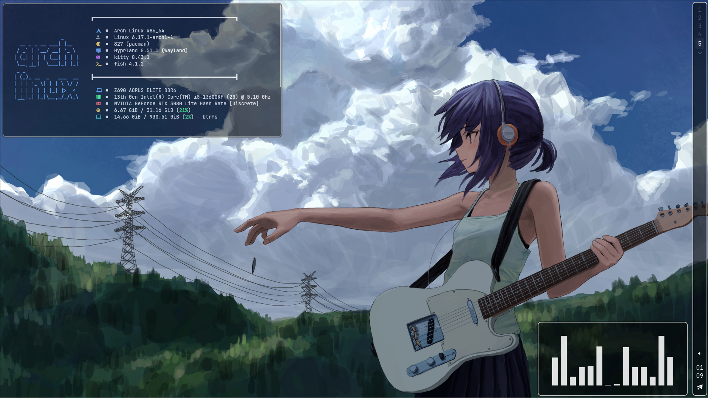
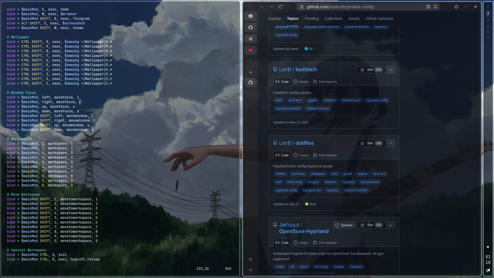
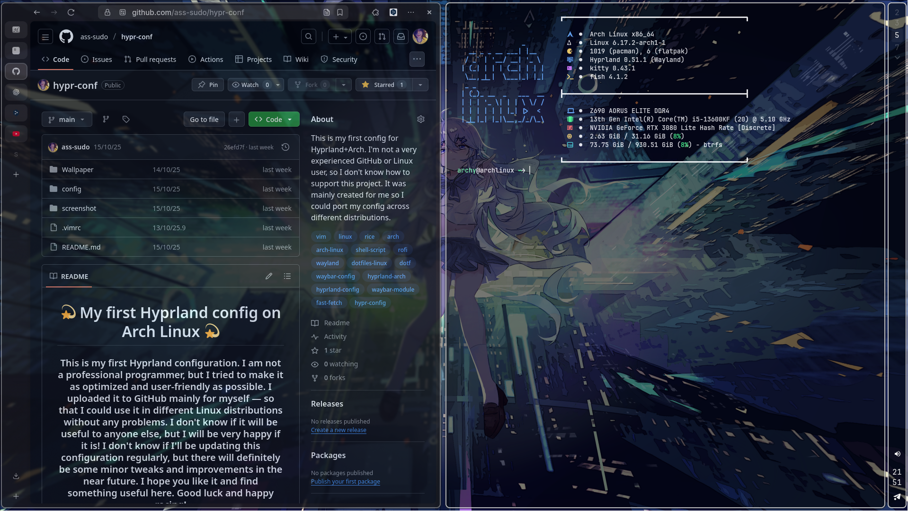
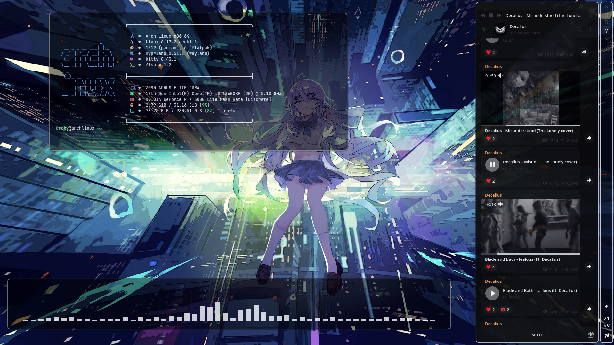

<h1 align="center">:dizzy: My first Hyprland config on Arch Linux :dizzy:</h1>

<h3 align="center">This is my first Hyprland configuration. I am not a professional programmer, but I tried to make it as optimized and user-friendly as possible. I uploaded it to GitHub mainly for myself — so that I could use it in different Linux distributions without any problems. I don't know if it will be useful to anyone else, but I will be very happy if it is! I don't know if I'll be updating this configuration regularly, but there will definitely be some minor tweaks and improvements in the near future. I hope you like it and find something useful here. Good luck and happy racing!
</h3>


<h1 align="center">Screenshot :camera_flash:</h1>

|  |  |
|:------------------------:|:------------------------:|
|  |  |

____

<h1 align="center">Program :inbox_tray:</h1>

<div align="center">

| Program :computer: | Component :gear: | Install command  :clipboard:     |
|----------------|---------------------|-----------------------------------|
| **Hyprland**   | Windows Manager     | `sudo pacman -S hyprland`         |
| **Kitty**      | Terminal            | `sudo pacman -S kitty`            |
| **Fish**       | Shell               | `sudo pacman -S fish`             | 
| **Nemo**       | File Manager        | `sudo pacman -S nemo`             |
| **Waybar**     | Bar                 | `sudo pacman -S waybar`           |
| **Mako**       | Notification        | `sudo pacman -S mako`             |
| **Steam**      | Gaming Platform     | `sudo pacman -S steam`            |
| **Rofi**       | Launcher            | `sudo pacman -S rofi`             |
| **GIMP**       | Image Editor        | `sudo pacman -S gimp`             |
| **Vim/NVim**   | Editor              | `sudo pacman -S vim/neovim`       |
| **Grim/Slurp** | Screenshot          | `sudo pacman -S grim slurp`       |
| **SwayBg**     | Wallpaper           | `sudo pacman -S swaybg`           |
| **nwg-look**   | All Themes          | `sudo pacman -S nwg-look`         |
| **Zen-Browser**| Browser             | `yay -S zen-browser-bin`          |
| **Telegram**   | Messenger           | `sudo pacman -S telegram-desktop` |
| **MPV**        | Media Player        | `sudo pacman -S mpv`              |
| **FastFetch**  | Terminal Application| `sudo pacman -S fastfetch`        |
| **BTop**       | Terminal Application| `sudo pacman -S btop`             |
| **Cava**       | Terminal Application| `sudo pacman -S cava`             |

</div>

<h1 align="center">Binds :bookmark_tabs:</h1>

<div align="center">

| Bind :rocket:                | Action :card_index: | Bind :rocket:             | Action :card_index: |
|------------------------------|-------------------|-----------------------------|--------------------|
| **SUPER + RETURN**           | Kitty             | **SUPER + SHIFT + D**       | Telegram           |
| **SUPER + Q**                | Kill Active       | **ALT + SHIFT + S**         | Screenshot         |
| **CTRL + SPACE**             | Change Language   | **SUPER + SHIFT + W**       | Steam              |
| **ALT +SHIFT + 1-0**         | Change Wallpaper  | **SUPER + SHIFT + E**       | GIMP               |
| **SUPER + F**                | Full Screen       | **SUPER + R**               | Rofi               |
| **SUPER + E**                | Nemo              | **SUPER + W**               | Browser            |
| **SUPER + SHIFT + ALT + S**  | Sleep             | **SUPER + SHIFT + ALT + Q** | PowerOff           |

<h1 align="center">Structure :books:</h1>

<div align="left">

```
/home/YOURUSR 
├── .config/ -- All configurations
│   ├── hypr/...
│   ├── waybar/...
│   ├── kitty/...
│   ├── rofi/...
│   ├── btop/...
│   ├── cava/...
│   ├── mako/...
│   ├── fastfetch/...
│   ├── fish/...
│   └── mineapps.list
│
├── Wallpaper/ -- Wallpaper
│   ├── 0.png
│   ├── ...
│   └── 9.png
│
├── Picturess/screenshot.png -- Screenshots
└── .vimrc
```

</div>

<h1 align="center">Install :jigsaw:</h1>

<div align="left">

#### Step 1 — Clone the repository
```
git clone https://github.com/ass-sudo/hypr-conf.git
```
#### Step 2 - Creating files with dependencies
```
mkdir -p ~/Pictures
mkdir -p ~/Wallpaper
```

#### Step 3 — Go to the project directory
```
cd hypr-conf
```

#### Step 4 — Copy config and wallpaper, .vimrc, cursor
```
cp -r config/* ~/.config/
cp -r conf-wallpaper /home/YOURUSR/Wallpaper
cp -r .vimrc /home/YOURUSR/
```

#### Step 5 install AUR
```
git clone https://aur.archlinux.org/yay.git
cd yay
makepkg -si
```

#### Step 6 — Install fonts from AUR
```
yay -S ttf-jetbrains-mono-nerd ttf-fira-code-nerd ttf-hack-nerd ttf-meslo-nerd ttf-mononoki-nerd ttf-dejavu-nerd
fc-cache -fv
```

#### Step 7 — Reload Hyprland
```
hyprctl reload
```
<h1 align="center">Install complete! :white_check_mark:</h1>

<h1 align="center">Recommendations :bug:</h1>

<div align="left">

#### Step 1 Set your screen parameters in
```
~/.config/hypr/hyprland.config
    |
    v

    monitor = NAME, SCREEN RESOLUTION@Hz, PLACE LOCATION, 1
        exeple: monitor = DP-1, 1920x1080@165, 0x0, 1 
```

#### Step 2 Specify your monitor for waybar
```
~/.config/waybar/config.jsonc
    |
    v

    [
      {
      "output": [ "DP-1" ], ~~~ change to your monitor
        "include": [
          "~/.config/waybar/bars/top.jsonc",
        ],
      }
    ]
```


