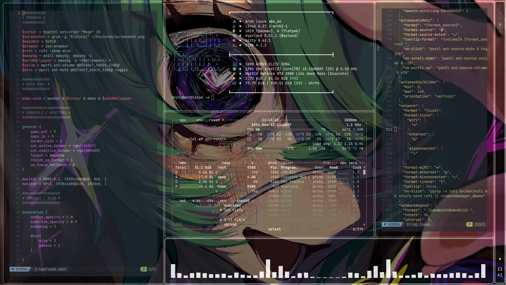

<h1 align="center">My first Hyprland config on Arch Linux</h1>

<h3 align="center">This is my first configuration on hyprland. I'm not particularly skilled at programming, but I tried to make it very optimized and user-friendly. I posted it on GitHub mainly for myself, so that I could use it on different distributions without any problems. I'm not sure if anyone else will use it, but I would be very happy if they did. At the moment, rofi and mako are not configured. I'm not sure if I will update the config in the future, but there will definitely be some minor updates in the near future. I hope you can install it and enjoy it, good luck!</h3>

<h1 align="center">Screenshot</h1>

|  |  |
|:------------------------:|:------------------------:|
|  |  |

____

<h1 align="center">Program</h1>

<table>
<tr>
<td>

| Program    | Component           |
|------------|---------------------|
| Hyprland   | Windows Manager     |
| Kitty      | Termenal            |
| Fish       | Shell               |
| Nemo       | File Manager        |
| Waybar     | Bar                 |
| Mako       | Notification        |
| Rofi       | Launcher            |
| GIMP       | Image Editor        |
| Vim/NVim   | Editor              |
| Grim/Slurp | Screenshot          |
| SwayBg     | Wallpaper           |
| nwg-look   | All Theams          |
| Zen-Browser| Browser             |
| Telegram   | Messenger           |
| FastFetsh  | Termenal Application|
| BTop       | Termenal Application|
| Cava       | Termenal Application|

</td>
<td>
  
</td>
</tr>
</table>

