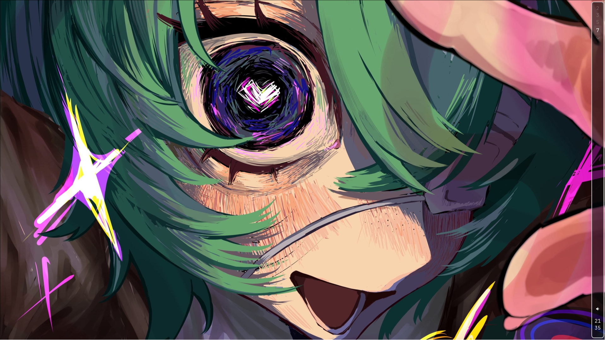

# hypr-conf

# **My first Hyprland config on Arch Linux**

____

## **Screenshot**

|  |  |
|:------------------------:|:------------------------:|
|  |  |

____

## **Program**

| Program    | Component           |
|------------|---------------------|
| Hyprland   | Windows Manager     |
| Kitty      | Termenal            |
| Fish       | Shell               |
| Nemo       | File Manager        |
| Waybar     | Bar                 |
| Mako       | Notification        |
| Rofi       | Launcher            |
| GIMP       | Image Editor        |
| Vim/NVim   | Editor              |
| Grim/Slurp | Screenshot          |
| SwayBg     | Wallpaper           |
| Zen-Browser| Browser             |
| Telegram   | Messenger           |
| FastFetsh  | Termenal Application|
| BTop       | Termenal Application|
| Cava       | Termenal Application|

